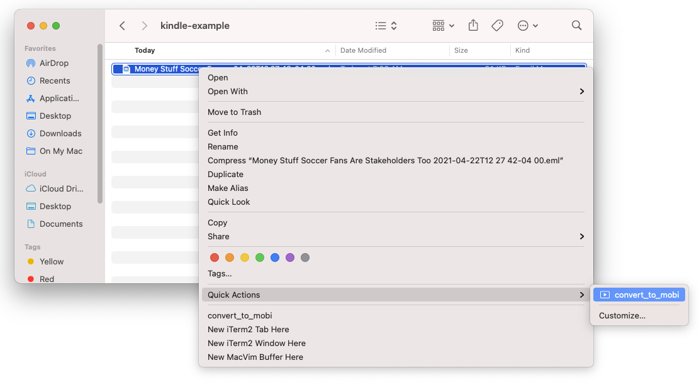
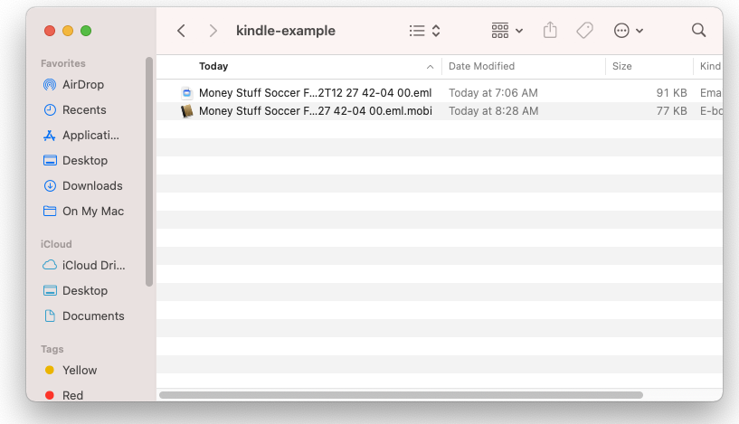

# Kindlize Email

Read newsletters on your Kindle!

## Usage

1. run `bin/setup`
1. run `bin/eml-to-mobi <path to .eml file>`
1. email `out.mobi` to your Kindle

## Apple Script Quick Action

Add this to Automator:

```bash
for f in "$@"
do
	cd <path to this repo> && \
	bin/eml-to-mobi "$f" && \
    mv out.mobi "${f}.mobi"
done
```




_Note: if you get errors with ruby versions, try adding `bundle exec` before the `bin/eml-to-mobi` call_
